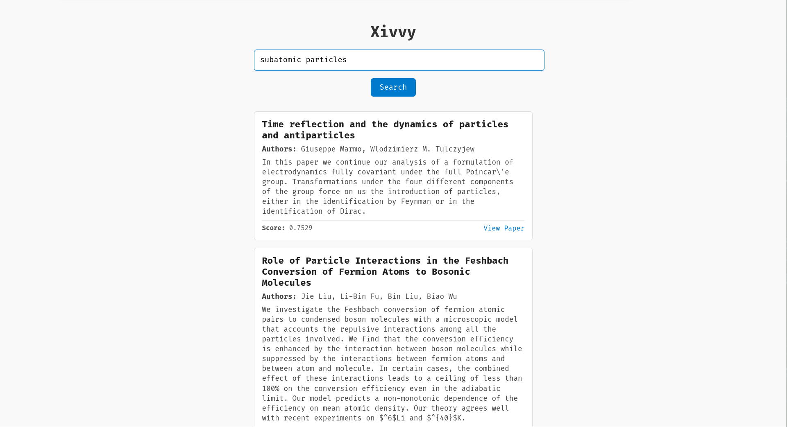

# xivvy

A Semantic Search Engine for arXiv papers.

**Note:** The search engine explicitly ignores updations to papers which are already added. The routine script just adds new papers (the IDs that have not been added yet).

Before you run xivvy locally, please pay heed to the following points:

- It would take a considerable amount of time to embed all the papers in the dataset, about 20 hours, considering projections. There are 2.7 million papers in the Kaggle dataset, so it's warranted to take a while to embed the metadata
- Docker is a prerequisite for your system. Docker is required for running the Qdrant instance which is the main component of Semantic Search.
- This was first meant to be a web project, to make it free for all as a web app. But it has to be rolled out like this until I find a hosting solution. Sorry, and thank you.
- Executing `upd.sh` might make your fans whirr.
- You must have an internet connection to download the Kaggle dataset, which is now standing at about 4.6 GB. Have some patience and an internet connection. (Trust me, it gets better after the first run to embed all papers).
- Paper metadata is directly sourced from the public [kaggle metadataset for arXiv](https://www.kaggle.com/datasets/Cornell-University/arxiv). shoutout to Cornell University for the dataset.

## First look



## To run xivvy locally

First, clone the repository:

```bash
git clone https://github.com/themohitnair/xivvy.git ~/xivvy
```

xivvy uses [uv](https://github.com/astral-sh/uv) for dependency management along with a Python 3.13 interpreter. It is a prerequisite for running the project, among other dependency managers which you may choose to use. The required packages are listed in `requirements.txt`. Notable dependencies include:

* `fastembed`
* `qdrant-client`
* `fastapi`
* `orjson`

To create a virtual environment within the project directory and install all dependencies in `requirements.txt`, you can run the init.sh script:

```bash
#!/usr/bin/bash

set -euo pipefail

echo "Creating virtual environment using uv."
uv venv --python=3.13

echo "Activating virtual environment."
source .venv/bin/activate

echo "Installing dependencies from requirements.txt."
uv pip install -r requirements.txt

echo "Your environment is ready to cook!"
```

The repository root must contain a directory called `kaggle`, within which there must be your `kaggle.json` file containing the following:

```json
{
  "username":"<Your Kaggle Username>",
  "key":"<Your Kaggle API Key>"
}
```

You can obtain this JSON file as it is from this [link](https://www.kaggle.com/settings) under the API section.

Use this command (with or without sudo, depending on your machine) to start a docker instance for the qdrant database and add the said directory `qdrant_storage` with the access port 6333:

```bash
sudo docker run -d -p 6333:6333 -v $(pwd)/qdrant_storage:/qdrant/storage qdrant/qdrant
```

You can use the following command to find the qdrant docker instance (with or without sudo, depending on your machine):

```bash
sudo docker ps
```

After this, you must add a cronjob to run `./upd.sh` weekly (assuming you want all the arXiv papers to be in scope for your search engine, even the ones appended regularly to it). You can change the interval as you'd like to, based on how frequently you want to update your database. Refer to [cronitor](https://crontab.guru/) to edit the interval section in the crontab.

Add appropriate permissions to `upd.sh`:

```bash
chmod +x upd.sh
```

Now, add the cronjob:

```bash
crontab -e
```

Add this line to the crontab:
**Note:** Replace /path/to/upd.sh with the actual absolute path to the upd.sh file within the clone directory. It is advisable to keep the `upd.log` in a handy location (again, with an absolute path).

```bash
* * * * * /path/to/upd.sh >> /path/to/upd.log 2>&1
```

You can now execute the `main.py` file as follows:

```python
python main.py
```
